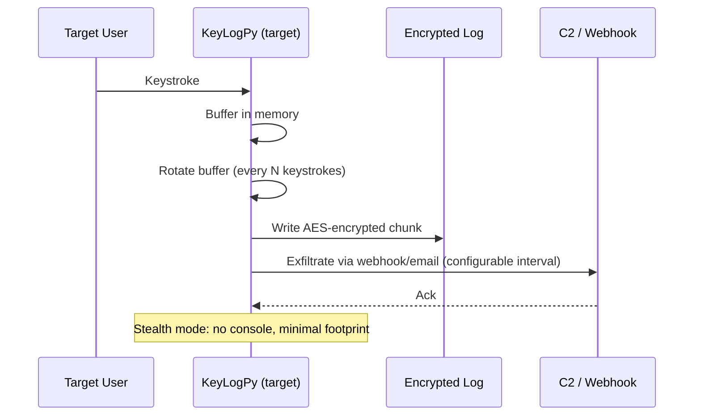

# KeyLogPy

> **⚠️ WARNING:** For authorized security testing only. Unauthorized keystroke logging is illegal under federal and state laws (US), RIPA (UK), and similar legislation worldwide. Only deploy on systems you own or have explicit written authorization to test.

Cross-platform keystroke logger with AES-encrypted exfiltration and optional stealth modes. Built for red-team ops where you need to capture input without burning a C2 channel on constant beaconing.

## Sequence Diagram



## Quick Start

```
# Start logging (foreground)
python keylogpy.py start --log-dir /tmp/logs

# Start in stealth mode (no console window)
python keylogpy.py start --stealth --log-dir /tmp/.cache

# Stop the logger
python keylogpy.py stop

# Check status
python keylogpy.py status
```

## Configuration

KeyLogPy is config-driven. Create `config.yaml` or pass CLI flags:

| Option | Default | Description |
|--------|---------|-------------|
| `--log-dir` | `~/.keylogpy/` | Where encrypted logs are stored |
| `--rotation` | `1000` | Keystrokes per log file before rotation |
| `--encrypt-key` | Auto-generated | AES-256 key (hex, 64 chars). Stored in `key.hex` |
| `--webhook` | None | HTTPS endpoint for exfiltration |
| `--smtp-server` | None | SMTP server for email exfil |
| `--smtp-user` | None | SMTP username |
| `--smtp-pass` | None | SMTP password |
| `--smtp-to` | None | Recipient for exfil emails |
| `--interval` | `300` | Exfiltration interval (seconds) |
| `--stealth` | False | Hide console window, minimize footprint |
| `--no-startup` | False | Don't add to startup/autostart |

## Stealth Mode

On Windows:
- No console window (`CREATE_NO_WINDOW` flag)
- Process named `svchost.exe` (via binary rename - manual step)
- Adds to HKCU\Run\... registry for persistence

On Linux:
- Detaches from terminal
- Renames process via `prctl(PR_SET_NAME, ...)`
- Adds to crontab or .bashrc for persistence

On macOS:
- LaunchAgent plist for persistence
- Process name spoofing via `setproctitle`

> Stealth features are partial. Full evasion requires packing, obfuscation, and AV testing — out of scope for this project.

## Log Format

Logs are AES-256-CBC encrypted with a random IV per file. Format:

```
[header: "KLP1" (4 bytes)][IV (16 bytes)][ciphertext][HMAC-SHA256 (32 bytes)]
```

Decrypt with:
```
python keylogpy.py decrypt --key key.hex --file log.klp
```

## Exfiltration

Two channels:
1. **Webhook**: POST encrypted log as base64 body to HTTPS endpoint
2. **Email**: SMTP with TLS, attachment is the encrypted log file

Both channels use the same encrypted format — the C2 never sees plaintext.

## Log Rotation

Files are named `klp_YYYYMMDD_HHMMSS_NNNN.klp`. Rotation triggers:
- Keystroke count exceeds `rotation` threshold
- Time-based rotation every 24h
- Manual rotation via `SIGUSR1` on Linux

## TODO

- [ ] USB keystroke injection detection (side project)
- [ ] Screenshot capture on specific keystrokes (e.g., login fields)
- [ ] Better Windows stealth — current process hiding is weak
- [ ] Clipboard monitoring
- [ ] Exfil via DNS tunneling (for restrictive egress)
- [ ] The config file parser is fragile with unicode paths. FIXME.

## Known Issues

- pynput requires root on Linux for global key capture. Run with sudo or configure permissions.
- pycryptodome's AES-GCM is faster but we use CBC + HMAC for compatibility. Change if you need speed.
- Webhook exfil blocks on network. Set interval high enough to not lag the target.
- The config YAML loader doesn't validate types. Passing a string where an int is expected will crash. FIXME.

## License

MIT. Seriously, don't be a creep.
